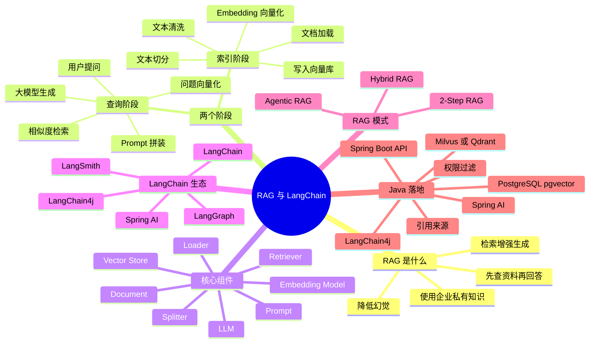
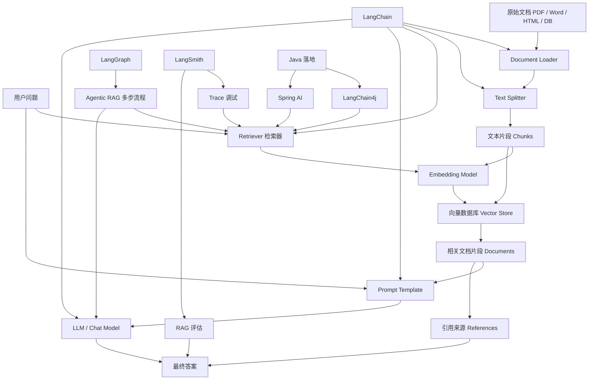
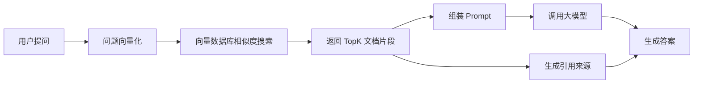
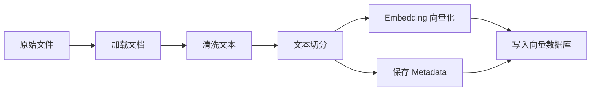

# RAG 与 LangChain 小白学习笔记：面向 Java 开发者

> 适合读者：有 Java 后端基础，但刚接触大模型、RAG、LangChain、向量数据库的开发者。  
> 整理日期：2026-04-28  
> 主要参考：LangChain 官方 Retrieval/RAG 文档、LangGraph Agentic RAG 文档、LangChain4j RAG 文档、Spring AI RAG 文档。  
> 说明：本文已将外部资料归纳进正文，不保留外部链接，适合作为离线学习材料。

---

## 目录

1. 先用一句话理解 RAG
2. 为什么 Java 开发者需要学 RAG
3. RAG 的核心思想
4. RAG 和传统搜索、微调的区别
5. RAG 的完整流程
6. 核心概念逐个讲清楚
7. LangChain 里的 RAG 是怎么组织的
8. 常见 RAG 架构模式
9. Java 开发者怎么落地 RAG
10. 一个 Java 项目的 RAG 架构示例
11. Mermaid 思维导图
12. Mermaid 知识图谱
13. RAG 查询流程图
14. RAG 索引流程图
15. 学习路线
16. 小白最容易踩的坑
17. RAG 质量优化清单
18. 适合 Java 开发者的实践任务
19. 常见问题
20. 最小知识闭环
21. 官方资料要点归纳
22. 推荐阅读顺序
23. 下一步建议

---

## 先用一句话理解 RAG

RAG，全称是 Retrieval-Augmented Generation，中文通常叫“检索增强生成”。

一句话解释：

> RAG 是让大模型回答问题前，先去你的知识库里查资料，再根据查到的资料生成答案。

如果把大模型看成一个“很会表达的人”，那么 RAG 就是在它回答之前，先把相关资料递给它看。

没有 RAG：

```text
用户提问 -> 大模型凭自己的训练记忆回答
```

有 RAG：

```text
用户提问 -> 检索你的知识库 -> 找到相关资料 -> 把资料和问题一起交给大模型 -> 大模型基于资料回答
```

---

## 为什么 Java 开发者需要学 RAG

Java 后端开发者常见的系统是这样的：

- 用户系统
- 订单系统
- WMS、ERP、CRM、OA
- 文档中心
- 知识库
- 工单系统
- 数据库报表系统
- 内部 API 平台

这些系统都有一个共同问题：

> 企业自己的知识、文档、数据，并不在大模型的训练数据里。

例如：

- 公司内部 SOP 文档
- 项目接口文档
- 业务规则说明
- 数据库字段含义
- 历史工单处理记录
- 产品手册
- 运维手册
- 法务、财务、人事制度

大模型不知道这些内容，或者即使知道也可能过时。

RAG 的价值就是：

> 不重新训练大模型，也能让大模型基于你自己的资料回答问题。

对 Java 开发者来说，RAG 本质上是一个后端系统：

```text
文件上传 + 文档解析 + 文本切分 + 向量化 + 向量数据库 + 检索 + Prompt 拼装 + 调用大模型 + 返回答案
```

你可以把它理解成：

> 搜索引擎 + 大模型回答器 + 后端服务编排。

---

## RAG 的核心思想

RAG 拆开看有三个词：

| 英文 | 中文 | 小白解释 |
| --- | --- | --- |
| Retrieval | 检索 | 先从知识库里找相关内容 |
| Augmented | 增强 | 把查到的资料补充给大模型 |
| Generation | 生成 | 大模型根据资料组织答案 |

核心流程：

```text
问题 -> 找资料 -> 带资料问模型 -> 得到答案
```

这和普通 ChatGPT 最大区别在于：

- 普通问答：模型主要依赖训练时学到的知识。
- RAG 问答：模型主要依赖你临时提供的上下文资料。

所以 RAG 特别适合：

- 企业知识库问答
- 代码库问答
- 合同条款问答
- 产品手册问答
- 政策制度问答
- 客服知识库
- 规章制度查询
- 内部系统操作指南

---

## RAG 和传统搜索、微调的区别

### RAG 和传统搜索

传统搜索更像这样：

```text
用户输入关键词 -> 搜索系统返回一堆文档链接
```

RAG 更像这样：

```text
用户提出自然语言问题 -> 系统找相关片段 -> 大模型总结成直接答案
```

对比：

| 能力 | 传统搜索 | RAG |
| --- | --- | --- |
| 输入 | 关键词为主 | 自然语言问题 |
| 输出 | 文档列表 | 直接答案 |
| 是否总结 | 通常不总结 | 会总结 |
| 是否能追问 | 弱 | 强 |
| 用户体验 | 用户自己看文档 | 系统替用户读文档 |

### RAG 和微调

微调是把知识或能力训练进模型里。RAG 是运行时把资料传给模型。

对比：

| 维度 | RAG | 微调 |
| --- | --- | --- |
| 更新知识 | 快，更新知识库即可 | 慢，需要重新训练或继续训练 |
| 成本 | 通常较低 | 通常较高 |
| 适合内容 | 经常变化的业务知识 | 稳定的风格、格式、任务模式 |
| 可追溯性 | 可以返回引用来源 | 较难解释答案来源 |
| 开发复杂度 | 后端系统复杂 | 模型训练复杂 |

初学者建议：

> 大多数企业知识问答场景，先做 RAG，不要一上来就微调。

---

## RAG 的完整流程

RAG 通常分成两个阶段：

1. 索引阶段：把资料处理进知识库。
2. 查询阶段：用户提问时检索并生成答案。

### 阶段一：索引阶段

索引阶段发生在用户提问之前。

```text
原始文档
  -> 文档加载
  -> 文本清洗
  -> 文本切分
  -> 向量化
  -> 存入向量数据库
```

举例：

```text
PDF 操作手册
  -> 读取 PDF 文本
  -> 去掉页眉页脚
  -> 每 500 字切成一个片段
  -> 每个片段转成 embedding 向量
  -> 存到 Milvus / PostgreSQL pgvector / Elasticsearch / Redis / Chroma
```

### 阶段二：查询阶段

查询阶段发生在用户提问时。

```text
用户问题
  -> 问题向量化
  -> 向量数据库相似度检索
  -> 取回相关文本片段
  -> 拼接 Prompt
  -> 调用大模型
  -> 返回答案和引用来源
```

举例：

```text
用户问：“入库单怎么取消？”
  -> 系统把问题转成向量
  -> 从 WMS 操作手册里找到“入库单取消规则”
  -> 把相关规则塞进 Prompt
  -> 大模型回答：“满足未上架、未审核等条件时可以取消……”
```

---

## 核心概念逐个讲清楚

### 1. Document：文档对象

在 RAG 里，文档不一定是一整个 Word 或 PDF。

它通常是一个结构化对象：

```text
Document {
  content: "正文内容",
  metadata: {
    source: "wms_manual.pdf",
    page: 12,
    title: "入库管理"
  }
}
```

`content` 是给模型看的文本。

`metadata` 是辅助信息，常用于：

- 标记来源文件
- 标记页码
- 标记业务模块
- 标记文档版本
- 做权限过滤
- 返回答案引用

Java 类比：

```java
public class KnowledgeDocument {
    private String content;
    private Map<String, Object> metadata;
}
```

### 2. Document Loader：文档加载器

文档加载器负责把不同格式的数据读出来。

常见来源：

- PDF
- Word
- Excel
- Markdown
- HTML
- 数据库
- Git 仓库
- Confluence
- Notion
- S3 / OSS 文件
- 接口返回的 JSON

Java 开发者可以理解成：

```text
不同数据源的 Reader / Parser / Adapter
```

例如：

```text
PDFLoader -> 读取 PDF
ExcelLoader -> 读取 Excel
WebLoader -> 抓网页
DatabaseLoader -> 查数据库
```

### 3. Text Splitter：文本切分器

为什么要切分？

因为大模型和向量检索都不适合直接处理超长文档。

如果把一本 200 页的手册整体塞进去，会有几个问题：

- 超过模型上下文长度
- 检索不精准
- 成本高
- 答案容易混入无关内容

所以要把大文档切成小片段。

例如：

```text
原文档：10000 字
切分后：
  chunk 1: 第 1-500 字
  chunk 2: 第 451-950 字
  chunk 3: 第 901-1400 字
```

这里有两个重要参数：

| 参数 | 含义 | 例子 |
| --- | --- | --- |
| chunk size | 每个片段多长 | 500 字、1000 token |
| chunk overlap | 相邻片段重叠多少 | 50 字、100 token |

为什么要 overlap？

因为一句完整的业务规则可能刚好跨越两个片段。重叠可以避免上下文断裂。

小白建议：

```text
普通中文业务文档：chunk size 500-1000 字，overlap 50-150 字
代码文档：按函数、类、Markdown 标题切分
表格数据：尽量按行、业务对象或记录切分
```

### 4. Embedding：向量化

Embedding 是把文本转换成一组数字。

例如：

```text
"入库单如何取消"
  -> [0.12, -0.45, 0.88, ...]
```

这些数字表示文本的语义。

语义相近的文本，向量距离也更近。

例如：

```text
"入库单如何取消"
"怎么作废入库单"
"入库单撤销流程"
```

这三个句子用词不同，但语义相近，向量检索可以把它们匹配到一起。

Java 类比：

```java
float[] vector = embeddingModel.embed("入库单如何取消");
```

### 5. Vector Store：向量数据库

向量数据库用于保存：

- 文本片段
- 文本片段对应的向量
- metadata

常见选择：

| 类型 | 示例 |
| --- | --- |
| 专用向量数据库 | Milvus、Qdrant、Weaviate、Pinecone |
| 关系型数据库扩展 | PostgreSQL + pgvector |
| 搜索引擎 | Elasticsearch、OpenSearch |
| 缓存/内存型 | Redis Vector、Chroma、FAISS |

Java 项目里常见选择：

- 企业已有 PostgreSQL：优先考虑 pgvector。
- 已经有 Elasticsearch：可以考虑 Elasticsearch 向量检索或混合检索。
- 独立 AI 知识库服务：可以考虑 Milvus 或 Qdrant。
- 本地学习 Demo：可以用内存向量库或 Chroma。

### 6. Retriever：检索器

Retriever 是 RAG 查询阶段的核心。

它负责：

```text
输入问题 -> 找到最相关的文档片段
```

最常见的是向量检索：

```text
把问题转成向量 -> 到向量库里找最相似的 topK 个片段
```

常见参数：

| 参数 | 含义 |
| --- | --- |
| topK | 返回最相关的几个片段 |
| score threshold | 相似度低于阈值就不要 |
| filter | 根据 metadata 过滤，例如部门、权限、文档类型 |

示例：

```text
topK = 5
scoreThreshold = 0.7
filter = department == "warehouse"
```

### 7. Prompt：提示词模板

RAG 的 Prompt 一般会包含三部分：

```text
系统规则：
你是一个企业知识库助手。只能根据给定资料回答。

检索到的资料：
{context}

用户问题：
{question}
```

一个基础模板：

```text
请根据下面的资料回答用户问题。
如果资料中没有答案，请回答“根据当前资料无法确定”，不要编造。

资料：
{context}

问题：
{question}
```

RAG 里很重要的一条规则：

> 要明确要求模型基于资料回答，不知道就说不知道。

否则模型可能会“脑补”。

### 8. LLM / Chat Model：大模型

大模型负责把检索到的资料组织成自然语言答案。

在 RAG 中，大模型不是唯一核心。它更像最后的“表达层”。

一个 RAG 系统质量不好，不一定是模型差，也可能是：

- 文档解析错了
- 文本切分太差
- embedding 模型不适合中文
- 检索参数不合理
- topK 太小或太大
- Prompt 没有限制住幻觉
- 知识库内容本身过时

---

## LangChain 里的 RAG 是怎么组织的

LangChain 是一个构建大模型应用的框架。

它把 RAG 相关能力抽象成多个组件：

| LangChain 概念 | 作用 | Java 开发类比 |
| --- | --- | --- |
| Document Loaders | 加载文档 | Reader / Parser / Adapter |
| Text Splitters | 切分文本 | 文本预处理工具 |
| Embedding Models | 文本向量化 | 特征提取服务 |
| Vector Stores | 保存和搜索向量 | 数据库 / 索引服务 |
| Retrievers | 检索相关文档 | Repository / SearchService |
| Prompt Templates | 组装提示词 | 模板引擎 |
| Chat Models | 调用大模型 | 外部 AI Client |
| Chains | 固定流程编排 | Service 方法编排 |
| Agents | 让模型决定调用什么工具 | 智能调度器 |
| LangGraph | 可控的状态图编排 | 工作流引擎 / 状态机 |
| LangSmith | 调试、观测、评估 | APM + Trace + Test Report |

对于 Java 开发者来说，可以这样理解：

```text
LangChain = 一套 AI 应用后端开发框架
LangGraph = 更强的流程编排和状态机
LangSmith = 调试、监控、评估平台
LangChain4j = Java 生态里类似 LangChain 的框架
Spring AI = Spring 官方 AI 应用抽象层
```

---

## 常见 RAG 架构模式

LangChain 文档里重点提到几类 RAG 模式：2-Step RAG、Agentic RAG、Hybrid RAG。

### 1. 2-Step RAG

这是最基础、最适合小白入门的 RAG。

固定两步：

```text
第一步：检索相关文档
第二步：把文档和问题交给模型生成答案
```

流程：

```text
Question -> Retriever -> Documents -> Prompt -> LLM -> Answer
```

优点：

- 简单
- 可控
- 容易调试
- 适合企业知识库问答

缺点：

- 不够灵活
- 对复杂问题处理能力弱
- 如果第一次检索错了，后面很难补救

适合场景：

- 文档问答
- 操作手册问答
- 规章制度问答
- FAQ 问答

### 2. Agentic RAG

Agentic RAG 不是固定流程，而是让模型自己判断要不要检索、检索几次、调用什么工具。

流程可能是：

```text
用户问题
  -> 模型判断需要查资料
  -> 调用检索工具
  -> 发现资料不够
  -> 重写问题再次检索
  -> 整合多个结果
  -> 生成答案
```

优点：

- 更灵活
- 可以多轮检索
- 适合复杂问题
- 可以组合多个工具

缺点：

- 成本更高
- 延迟更高
- 调试更难
- 行为不如固定流程稳定

适合场景：

- 复杂客服助手
- 多知识库问答
- 需要调用多个系统的助手
- 需要规划和多步推理的任务

### 3. Hybrid RAG

Hybrid RAG 通常指混合检索。

最常见的是：

```text
向量检索 + 关键词检索
```

为什么要混合？

因为向量检索擅长语义相似，关键词检索擅长精确匹配。

例如：

```text
“ASN-20260428-001 入库异常怎么处理？”
```

这里的 `ASN-20260428-001` 是一个精确编号，关键词检索更可靠。

而：

```text
“货到了但是系统不能收货怎么办？”
```

这是自然语言描述，向量检索更适合。

Hybrid RAG 会把两种结果融合，再交给模型。

适合场景：

- 业务编号很多
- 专有名词很多
- 文档既有自然语言又有结构化字段
- 企业搜索场景

---

## Java 开发者怎么落地 RAG

虽然 LangChain 官方核心文档主要是 Python 和 JavaScript，但 Java 开发者可以重点看两个生态：

1. LangChain4j
2. Spring AI

### 方案一：LangChain4j

LangChain4j 是 Java 生态里常用的大模型应用框架，提供：

- Chat Model 抽象
- Embedding Model 抽象
- Document Loader
- Text Splitter
- Embedding Store
- Content Retriever
- AI Service
- RAG 支持

你可以把它理解成：

```text
Java 版 LangChain 思路
```

一个简化的 LangChain4j 风格伪代码：

```java
interface Assistant {
    String chat(String userMessage);
}

// 1. 准备大模型
ChatLanguageModel chatModel = ...;

// 2. 准备 embedding 模型
EmbeddingModel embeddingModel = ...;

// 3. 准备向量存储
EmbeddingStore<TextSegment> embeddingStore = ...;

// 4. 加载并切分文档，然后写入向量库
Document document = ...;
EmbeddingStoreIngestor ingestor = EmbeddingStoreIngestor.builder()
        .embeddingModel(embeddingModel)
        .embeddingStore(embeddingStore)
        .build();
ingestor.ingest(document);

// 5. 创建检索器
ContentRetriever retriever = EmbeddingStoreContentRetriever.builder()
        .embeddingStore(embeddingStore)
        .embeddingModel(embeddingModel)
        .maxResults(5)
        .minScore(0.6)
        .build();

// 6. 创建带 RAG 能力的 AI Service
Assistant assistant = AiServices.builder(Assistant.class)
        .chatLanguageModel(chatModel)
        .contentRetriever(retriever)
        .build();

// 7. 提问
String answer = assistant.chat("入库单如何取消？");
```

注意：

> 上面代码用于帮助理解结构。实际类名、包名和构造方式请以你项目使用的 LangChain4j 版本文档为准。

### 方案二：Spring AI

如果你的项目是 Spring Boot，Spring AI 会更贴近 Java 企业项目习惯。

Spring AI 提供：

- ChatClient
- VectorStore
- EmbeddingModel
- DocumentReader
- Advisors
- QuestionAnswerAdvisor

你可以把它理解成：

```text
Spring 风格的大模型应用开发抽象
```

一个简化的 Spring AI 风格伪代码：

```java
@Service
public class RagService {

    private final ChatClient chatClient;
    private final VectorStore vectorStore;

    public RagService(ChatClient.Builder builder, VectorStore vectorStore) {
        this.chatClient = builder.build();
        this.vectorStore = vectorStore;
    }

    public String ask(String question) {
        return chatClient.prompt()
                .user(question)
                .advisors(new QuestionAnswerAdvisor(vectorStore))
                .call()
                .content();
    }
}
```

实际项目中，你还需要：

- 配置大模型 API Key
- 配置 embedding 模型
- 配置 vector store
- 写文档导入任务
- 做权限控制
- 做答案引用
- 做日志和监控

### Java 项目选型建议

| 场景 | 建议 |
| --- | --- |
| Spring Boot 项目 | 优先看 Spring AI |
| 想快速做 Java RAG Demo | LangChain4j 上手快 |
| 团队熟悉 Spring 生态 | Spring AI 更自然 |
| 想对标 LangChain 概念 | LangChain4j 更接近 |
| 需要复杂 Agent 工作流 | Java 里要谨慎评估成熟度，也可考虑独立 Python AI 服务 |
| 企业内部知识库 | Java 后端 + 向量库 + 模型 API 是常见架构 |

---

## 一个 Java 项目的 RAG 架构示例

假设你要做一个“WMS 操作手册问答助手”。

### 业务需求

用户可以问：

- 入库单怎么取消？
- 收货异常怎么处理？
- 库存冻结是什么意思？
- 波次拣货失败怎么排查？
- 盘点差异怎么审核？

系统要回答：

- 基于 WMS 操作手册
- 尽量给出步骤
- 能返回引用文档
- 不知道就说不知道
- 不允许越权查看其他部门文档

### 推荐架构

```text
前端页面
  -> Java Spring Boot API
  -> RAG Service
     -> Retriever
        -> Vector Store
        -> Metadata Filter
     -> Prompt Builder
     -> LLM Client
  -> 返回答案 + 引用来源
```

### 数据表设计示例

如果用 PostgreSQL + pgvector，可以有一张知识片段表：

```sql
CREATE TABLE knowledge_chunk (
    id BIGSERIAL PRIMARY KEY,
    document_id BIGINT NOT NULL,
    content TEXT NOT NULL,
    embedding VECTOR(1536),
    source_name VARCHAR(255),
    page_no INT,
    module VARCHAR(100),
    department VARCHAR(100),
    version VARCHAR(50),
    created_at TIMESTAMP DEFAULT CURRENT_TIMESTAMP
);
```

字段解释：

| 字段 | 含义 |
| --- | --- |
| id | 片段 ID |
| document_id | 原始文档 ID |
| content | 切分后的文本 |
| embedding | 文本向量 |
| source_name | 来源文件 |
| page_no | 页码 |
| module | 业务模块 |
| department | 所属部门 |
| version | 文档版本 |
| created_at | 入库时间 |

### 后端模块划分

```text
com.example.rag
  ├── controller
  │   └── RagChatController.java
  ├── service
  │   ├── RagChatService.java
  │   ├── DocumentIngestService.java
  │   ├── EmbeddingService.java
  │   └── RetrievalService.java
  ├── repository
  │   └── KnowledgeChunkRepository.java
  ├── model
  │   ├── KnowledgeChunk.java
  │   ├── RagRequest.java
  │   └── RagResponse.java
  └── config
      ├── AiModelConfig.java
      └── VectorStoreConfig.java
```

### 查询接口示例

```http
POST /api/rag/chat
Content-Type: application/json

{
  "question": "入库单怎么取消？",
  "department": "warehouse"
}
```

返回：

```json
{
  "answer": "根据 WMS 操作手册，入库单在未上架且未完成审核时可以取消。操作步骤是……",
  "references": [
    {
      "source": "WMS操作手册.pdf",
      "page": 12,
      "module": "入库管理"
    }
  ]
}
```

### Prompt 模板示例

```text
你是一个 WMS 系统知识库助手。

请严格根据【资料】回答【问题】。

要求：
1. 如果资料中没有明确答案，回答“根据当前资料无法确定”。
2. 不要编造资料中不存在的规则。
3. 如果资料中包含操作步骤，请按步骤列出。
4. 回答最后给出引用来源。

【资料】
{context}

【问题】
{question}
```

---

## Mermaid 思维导图



---

## Mermaid 知识图谱



---

## RAG 查询流程图



---

## RAG 索引流程图



---

## 学习路线

### 第 1 阶段：先理解概念

目标：

```text
知道 RAG 是什么，知道为什么需要向量数据库。
```

你需要掌握：

- LLM 是什么
- Prompt 是什么
- Embedding 是什么
- Vector Store 是什么
- Retriever 是什么
- RAG 为什么能减少幻觉

建议输出：

```text
能用自己的话讲清楚：
“用户问一个问题后，RAG 系统内部发生了什么？”
```

### 第 2 阶段：做一个最小 Demo

目标：

```text
上传一个 Markdown 或 PDF，然后可以问答。
```

最小功能：

- 读取一个文档
- 切分文档
- 调 embedding
- 存到内存向量库或本地向量库
- 用户提问
- 检索 topK
- 调大模型回答

不要一开始就做：

- 权限系统
- 多租户
- 工作流
- Agent
- 复杂前端
- 多种文件格式

### 第 3 阶段：接入真实 Java 项目

目标：

```text
在 Spring Boot 项目里提供一个 /chat 接口。
```

你需要补齐：

- REST API
- 文档上传接口
- 文档解析任务
- 向量库配置
- Prompt 模板
- 答案引用
- 错误处理
- 日志记录

### 第 4 阶段：提升检索质量

目标：

```text
让系统真的答得准。
```

重点优化：

- chunk size
- chunk overlap
- embedding 模型
- topK
- score threshold
- metadata filter
- hybrid search
- rerank
- 文档质量

### 第 5 阶段：上线生产

目标：

```text
让 RAG 系统安全、稳定、可观测。
```

需要考虑：

- 用户权限
- 文档权限
- 敏感信息过滤
- 请求限流
- 模型调用超时
- 成本统计
- 检索日志
- 答案质量评估
- 数据更新机制

---

## 小白最容易踩的坑

### 1. 以为 RAG 准不准只取决于大模型

不是。

RAG 的准确率通常更依赖：

- 文档质量
- 切分策略
- 检索质量
- Prompt 约束
- embedding 模型

模型只是最后一步。

### 2. chunk 切得太大

切得太大，检索回来的内容会很杂。

后果：

- Prompt 里塞太多无关内容
- 模型抓不住重点
- 成本上升

### 3. chunk 切得太小

切得太小，上下文不完整。

后果：

- 业务规则被切断
- 模型只能看到半句话
- 答案缺步骤

### 4. 没有 metadata

没有 metadata，就很难做：

- 来源引用
- 权限过滤
- 文档版本控制
- 业务模块筛选

建议每个 chunk 至少带：

```text
source_name
page_no
document_id
module
version
department
```

### 5. 没有要求模型“不知道就说不知道”

Prompt 里必须明确：

```text
如果资料中没有答案，请回答无法确定，不要编造。
```

### 6. 没有做评估

很多 RAG Demo 看起来能跑，但上线后答不准。

应该准备一批测试问题：

```text
问题、标准答案、期望引用文档、期望页码
```

每次调整 chunk、embedding、topK 后，都跑一次评估。

---

## RAG 质量优化清单

### 文档侧

- 文档是否最新
- 文档是否有重复内容
- 是否去掉页眉页脚
- 表格是否正确转换
- 图片里的文字是否 OCR
- 是否保留标题层级
- 是否保存来源页码

### 切分侧

- 是否按标题切分
- 是否按段落切分
- chunk size 是否合理
- overlap 是否合理
- 是否避免把表格切碎
- 是否避免把代码块切碎

### 检索侧

- topK 是否合适
- 阈值是否合适
- 是否需要 hybrid search
- 是否需要 rerank
- 是否需要 metadata filter
- 是否支持多轮改写 query

### 生成侧

- Prompt 是否明确要求基于资料
- 是否要求不知道就说不知道
- 是否要求引用来源
- 是否限制回答格式
- 是否避免把无关资料塞给模型

### 生产侧

- 是否记录每次检索结果
- 是否记录模型输入输出
- 是否能追踪用户问题
- 是否有成本统计
- 是否有超时重试
- 是否有权限控制

---

## 适合 Java 开发者的实践任务

### 任务 1：做一个本地 Markdown 问答

输入：

```text
一个 README.md
```

实现：

- 读取 Markdown
- 按标题切分
- 存入内存向量库
- 提供问答接口

目标：

```text
理解 RAG 最小闭环。
```

### 任务 2：做一个 PDF 操作手册问答

输入：

```text
一个 WMS 操作手册 PDF
```

实现：

- PDF 解析
- 文本清洗
- chunk 入库
- 问答时返回页码

目标：

```text
理解文档解析和引用来源。
```

### 任务 3：接入 PostgreSQL + pgvector

实现：

- knowledge_document 表
- knowledge_chunk 表
- embedding 字段
- 相似度搜索 SQL

目标：

```text
理解向量数据库不是魔法，本质还是索引和相似度查询。
```

### 任务 4：增加权限过滤

实现：

```text
用户只能检索自己部门的文档。
```

目标：

```text
理解企业 RAG 必须做权限控制。
```

### 任务 5：增加评估集

准备 20 个问题：

```text
问题
标准答案
期望引用文档
期望页码
```

目标：

```text
每次优化都有客观指标。
```

---

## 常见问题

### Q1：RAG 一定需要向量数据库吗？

不一定。

小 Demo 可以用内存向量库。

生产环境通常需要一个可持久化、可扩展、支持过滤的向量存储。

### Q2：RAG 能完全避免幻觉吗？

不能。

RAG 可以降低幻觉，但不能保证完全没有。

你需要：

- Prompt 限制
- 引用来源
- 检索质量优化
- 不知道就拒答
- 评估和监控

### Q3：是不是把所有文档都扔进去就行？

不是。

低质量文档会导致低质量回答。

需要：

- 清洗
- 去重
- 切分
- 加 metadata
- 做版本管理

### Q4：topK 越大越好吗？

不是。

topK 太小可能漏资料。

topK 太大会引入噪音，还会增加 token 成本。

常见初始值：

```text
topK = 3 到 8
```

然后根据评估结果调整。

### Q5：Java 项目应该用 LangChain、LangChain4j 还是 Spring AI？

如果你是 Java/Spring Boot 开发者：

- 想快速理解 LangChain 思路：看 LangChain 官方文档。
- 想写 Java Demo：看 LangChain4j。
- 想集成 Spring Boot 生产项目：看 Spring AI。

### Q6：RAG 和 Agent 是一回事吗？

不是。

RAG 是一种“查资料再回答”的技术路线。

Agent 是一种“让模型自己决定下一步做什么”的应用模式。

Agent 可以使用 RAG 作为工具，所以有 Agentic RAG。

---

## 最小知识闭环

如果你只记住一张图，就记住这个：

```text
文档 -> 切分 -> 向量化 -> 向量库

问题 -> 向量化 -> 检索 -> 相关片段 -> Prompt -> 大模型 -> 答案
```

如果你只记住一句话，就记住这个：

> RAG 不是让模型变聪明，而是让模型回答前先看到正确资料。

---

## 官方资料要点归纳

本节把前面参考过的官方资料消化成离线笔记，不保留外部链接。为了方便学习，下面不是逐字搬运官方原文，而是按 Java 开发者最容易理解的方式重新组织。

### LangChain Retrieval 文档要点

LangChain 的 Retrieval 文档重点讲的是：应用如何把外部知识取回来，再交给模型使用。

核心观点：

- 大模型本身不适合直接保存企业实时知识。
- 企业知识应该放在外部数据源里，比如文件、数据库、搜索引擎、向量数据库。
- RAG 的关键不是“模型多聪明”，而是“能不能找到正确上下文”。
- Retrieval 是 RAG 的基础能力，负责根据用户问题找相关内容。

LangChain 把检索相关能力拆成几个模块：

| 模块 | 作用 | Java 类比 |
| --- | --- | --- |
| Document Loader | 读取外部资料 | 文件解析器、数据库读取器 |
| Text Splitter | 把长文档切成片段 | 文本预处理工具 |
| Embedding Model | 把文本转成向量 | 特征提取服务 |
| Vector Store | 存储和搜索向量 | 向量索引数据库 |
| Retriever | 对外提供检索能力 | SearchService |
| Prompt | 把资料和问题组装给模型 | 模板引擎 |

官方文档强调，RAG 不是一个单点功能，而是一条数据链路：

```text
数据准备 -> 索引构建 -> 查询检索 -> 上下文组装 -> 模型生成
```

对 Java 开发者来说，最应该先掌握的是：

- 文档如何进入系统。
- 文档如何切分。
- 切分后的片段如何向量化。
- 用户问题如何匹配到片段。
- 匹配结果如何进入 Prompt。

### LangChain RAG Agent 文档要点

LangChain 的 RAG Agent 文档重点讲的是：RAG 不只有固定流程，也可以做成 Agent 工具。

基础 RAG 是固定流程：

```text
用户问题 -> 检索 -> 生成答案
```

RAG Agent 是动态流程：

```text
用户问题 -> 模型判断是否需要检索 -> 调用检索工具 -> 判断资料是否足够 -> 生成答案或继续检索
```

RAG Agent 的特点：

- 模型可以决定是否调用检索工具。
- 模型可以围绕问题多次检索。
- 模型可以把检索结果和自己的推理结合起来。
- 更适合复杂问题，但成本和不确定性也更高。

小白阶段建议：

> 先掌握固定的 2-Step RAG，再学习 RAG Agent。

原因：

- 固定 RAG 容易理解。
- 固定 RAG 容易调试。
- 固定 RAG 更适合企业系统第一版。
- Agentic RAG 更适合在基础稳定后增强能力。

### LangChain Knowledge Base / Semantic Search 文档要点

这部分官方资料重点讲的是如何把知识库做成可以语义搜索的数据源。

传统关键词搜索依赖字面匹配：

```text
用户搜“取消入库单”
文档里也必须有“取消入库单”这些词，才容易命中。
```

语义搜索依赖向量相似度：

```text
用户问“入库单怎么作废”
文档里写“取消入库单”
系统仍然可能判断两者语义相近。
```

知识库构建流程：

```text
加载文档 -> 切分文本 -> 生成向量 -> 存入向量库 -> 提供相似度检索
```

这里最关键的是切分策略。

切分太大：

- 一个片段里包含太多无关内容。
- 检索回来后模型容易被干扰。
- token 成本更高。

切分太小：

- 上下文不完整。
- 规则和解释可能被拆散。
- 模型看到的信息不够。

推荐理解：

> 切分不是简单按字数裁剪，而是尽量保留语义完整性。

例如：

- Markdown 文档优先按标题切分。
- PDF 手册优先按章节和段落切分。
- 代码文档优先按类、函数、方法切分。
- 表格数据优先按业务行或业务对象切分。

### LangGraph Agentic RAG 文档要点

LangGraph 更像一个“状态机”或“工作流编排框架”。它适合处理比普通 Chain 更复杂的流程。

在 Agentic RAG 中，常见节点包括：

- 接收用户问题。
- 判断是否需要检索。
- 调用检索工具。
- 判断检索结果是否相关。
- 必要时重写问题。
- 再次检索。
- 生成最终答案。

它的思路很像 Java 后端里的流程编排：

```text
状态 A -> 条件判断 -> 状态 B -> 工具调用 -> 状态 C -> 最终输出
```

适合使用 LangGraph 思路的场景：

- 一个问题需要多次查询资料。
- 需要判断资料是否足够。
- 需要在多个工具之间切换。
- 需要明确控制流程分支。
- 需要可追踪每一步执行结果。

不建议小白一开始就做 Agentic RAG。

原因：

- 调试难度更高。
- 生成结果更不稳定。
- 成本更高。
- 需要先理解普通 RAG 的检索质量问题。

推荐路径：

```text
2-Step RAG -> Hybrid RAG -> Rerank -> Agentic RAG
```

### LangSmith Retriever Trace 文档要点

LangSmith 的检索追踪资料重点解决一个问题：

> 当 RAG 答错时，怎么知道是哪里错了？

RAG 答错通常有几种原因：

- 没检索到正确文档。
- 检索到了正确文档，但排序太靠后。
- 检索结果太多，干扰了模型。
- Prompt 没有约束模型。
- 模型没有正确使用资料。

所以生产系统要记录：

- 用户原始问题。
- 实际检索 query。
- 返回了哪些文档片段。
- 每个片段的相似度分数。
- 最终传给模型的 Prompt。
- 模型生成的答案。
- 用户反馈。

Java 项目里，即使不用 LangSmith，也应该自己记录类似日志。

可以设计一个 `rag_trace_log` 表：

```sql
CREATE TABLE rag_trace_log (
    id BIGSERIAL PRIMARY KEY,
    question TEXT,
    retrieved_chunk_ids TEXT,
    prompt TEXT,
    answer TEXT,
    user_id VARCHAR(100),
    created_at TIMESTAMP DEFAULT CURRENT_TIMESTAMP
);
```

这张表的价值很大：

- 排查为什么答错。
- 对比不同 topK 的效果。
- 对比不同 embedding 模型。
- 做离线评估数据。
- 做用户反馈闭环。

### LangSmith Evaluation 文档要点

RAG 系统不能只靠主观感觉判断好坏，应该准备评估集。

评估集可以包含：

| 字段 | 含义 |
| --- | --- |
| question | 测试问题 |
| expected_answer | 标准答案 |
| expected_source | 期望来源文档 |
| expected_page | 期望页码 |
| must_contain | 答案必须包含的关键点 |
| must_not_contain | 答案不能出现的错误点 |

评估应该分两层：

第一层：检索评估。

```text
正确文档有没有被检索出来？
正确片段是否排在前几名？
```

第二层：答案评估。

```text
最终答案是否正确？
是否基于资料回答？
是否有编造？
是否格式符合要求？
```

对企业 RAG 来说，检索评估尤其重要。

因为如果第一步没有取回正确资料，后面模型再强也很难答对。

### LangChain4j RAG 文档要点

LangChain4j 是 Java 生态里构建大模型应用的框架。它把 RAG 拆成 Java 开发者熟悉的对象和服务。

常见核心对象：

| 概念 | 作用 |
| --- | --- |
| ChatLanguageModel | 聊天大模型 |
| EmbeddingModel | 向量模型 |
| Document | 文档对象 |
| TextSegment | 文本片段 |
| EmbeddingStore | 向量存储 |
| ContentRetriever | 内容检索器 |
| AiServices | 把接口变成 AI 服务 |

LangChain4j 的思想是：

```text
先把知识导入 EmbeddingStore，再让 ContentRetriever 在问答时取回相关内容。
```

它适合 Java 开发者快速做 Demo，因为它的抽象比较接近 Java 接口和 Builder 模式。

一个典型流程：

```text
创建 ChatModel
创建 EmbeddingModel
创建 EmbeddingStore
加载文档
切分文档
写入 EmbeddingStore
创建 ContentRetriever
创建 AI Service
调用接口问答
```

学习 LangChain4j 时，不要只看怎么调通代码，还要理解每个对象在 RAG 链路中的位置。

### Spring AI RAG 文档要点

Spring AI 是 Spring 生态中的 AI 应用抽象。对 Spring Boot 项目来说，它的集成方式更自然。

常见核心概念：

| 概念 | 作用 |
| --- | --- |
| ChatClient | 调用聊天模型 |
| EmbeddingModel | 生成向量 |
| VectorStore | 向量存储 |
| Document | 文档对象 |
| Advisor | 在调用模型前后增强流程 |
| QuestionAnswerAdvisor | 用向量库内容增强问答 |

Spring AI 的 RAG 思路可以理解成：

```text
ChatClient 负责对话，VectorStore 负责知识库，Advisor 负责把检索结果自动塞进上下文。
```

它适合已有 Spring Boot 项目的团队，因为可以和现有体系结合：

- 配置文件
- Bean 管理
- REST Controller
- Service 层
- 数据库
- 日志
- 权限
- 监控

Spring AI 更像是把 RAG 变成 Spring 应用里的基础设施。

如果你已经在做企业 Java 项目，可以优先考虑：

```text
Spring Boot + Spring AI + PostgreSQL pgvector
```

或者：

```text
Spring Boot + Spring AI + Elasticsearch / Milvus / Redis Vector
```

### Java 开发者最终应该形成的完整理解

把这些官方资料合起来看，RAG 不是一个框架专属能力，而是一套通用架构模式：

```text
知识来源
  -> 文档解析
  -> 文本切分
  -> 向量化
  -> 向量存储
  -> 检索
  -> Prompt 组装
  -> 大模型生成
  -> 引用和评估
```

LangChain、LangChain4j、Spring AI 的差异主要在代码写法和生态，而不是底层思想。

作为 Java 开发者，最重要的是把 RAG 当成一个后端系统来设计：

- 有数据导入链路。
- 有查询链路。
- 有权限控制。
- 有日志和追踪。
- 有质量评估。
- 有成本和性能控制。

只会调用模型 API，不等于会做 RAG。

真正可用的 RAG，要把“数据工程、搜索工程、Prompt 工程、后端工程、评估工程”结合起来。

---

## 推荐阅读顺序

1. 先读本文的“RAG 的完整流程”和“核心概念逐个讲清楚”。
2. 再读 LangChain 官方 Retrieval 总览。
3. 然后做一个最小 2-Step RAG Demo。
4. 如果你写 Java，接着读 LangChain4j RAG Tutorial。
5. 如果你写 Spring Boot，接着读 Spring AI RAG 文档。
6. 等基础 RAG 跑通后，再研究 LangGraph Agentic RAG 和 LangSmith 评估。

---

## 下一步建议

你可以按下面顺序动手：

```text
第 1 天：理解 RAG 概念，画出流程图
第 2 天：用一个 txt 或 md 文件做最小问答
第 3 天：接入 PDF 解析
第 4 天：接入向量数据库
第 5 天：做 Spring Boot API
第 6 天：增加引用来源和权限过滤
第 7 天：准备评估集，开始调参
```

完成这 7 步，你就已经具备做企业级 RAG 原型的基础能力。
